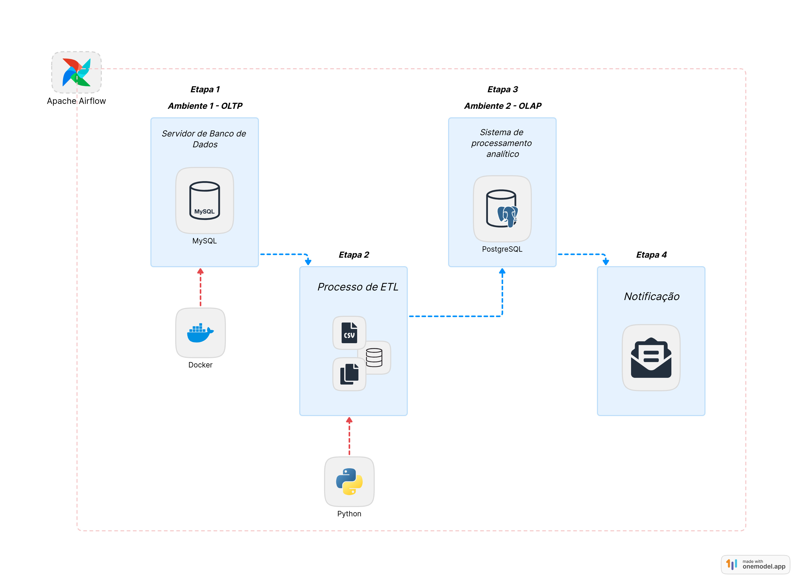
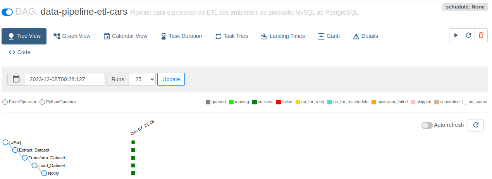
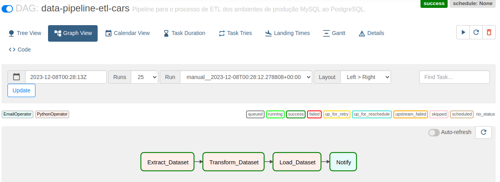
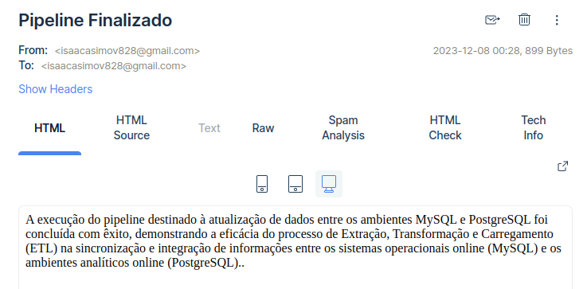

# Engenharia de Fluxos de Dados: Desvendando a Orquestração com Apache Airflow!

Ao iniciar a construção deste data pipeline, nos propusemos a estabelecer um processo fluido e automatizado, desde a coleta inicial de dados até a execução bem-sucedida das tarefas de ETL. Utilizando tecnologias como Docker, Apache Airflow, MySQL e PostgreSQL, delineamos uma abordagem eficiente para movimentar dados entre ambientes distintos.

## Pré-requisitos para instalação
- Docker
- MySQL
- PostgreSQL
- Airflow
- Python
- VS Code

As configurações de execução destas aplicação encontram-se no artigo escrito na plataforma Medium que abranje em sua grande maiores o passo-a-passo de instalação

## Metodologia

- Configuração do Ambiente OLTP:
Nesta etapa, focaremos na configuração do ambiente I (OLTP), estabelecendo as bases necessárias para a execução dos processos.

- Configuração do Ambiente OLAP:
Em seguida, procederemos com a configuração do ambiente II (OLAP), criando um ambiente analítico para suportar a transformação e análise de dados.

- Processo de ETL (Extração, Transformação e Carga):
Avançaremos para a etapa de ETL, na qual realizaremos a extração, transformação e carga de dados entre os ambientes OLTP e OLAP, garantindo a integridade e qualidade dos dados.

- Implementação de Notificações por E-mail:
Para aprimorar o monitoramento, adicionaremos a implementação de notificações por e-mail, permitindo uma gestão do processo em curso.

## Resultados

Após iniciar o contêiner do Docker, o Airflow estará operacional em alguns instantes. Acesse o painel administrativo no navegador, digitando http://localhost:8080. A partir desse painel, você pode iniciar e monitorar o processamento em andamento. Explore as funcionalidades do Airflow para uma gestão eficiente dos fluxos de trabalho.

Concluídos esses passos, podemos acessar a função "Graph View". Essa funcionalidade permite acompanhar o fluxo das execuções de tarefas e verificar, se necessário, possíveis erros nos logs de cada tarefa.

Conforme evidenciado na imagem acima, o fluxo de tarefas de ETL foi concluído com sucesso, sem nenhum tipo de erro. Aguardamos agora a notificação por e-mail sobre o sucesso da aplicação. Para isso, podemos verificar a caixa de entrada no serviço da mailtrap.io e ler a mensagem de sucesso configurada na aplicação de ETL anteriormente.

Assim, alcançamos nosso objetivo, uma vez que os ambientes e tarefas foram concluídos com êxito em nossa aplicação.

## Conclusão

Em resumo, a jornada do data pipeline abrangeu desde a coleta de dados até a execução bem-sucedida das tarefas de ETL. Utilizando Docker, Airflow, MySQL, PostgreSQL e serviços como Mailtrap.io, conseguimos construir um pipeline eficiente, automatizado e capaz de mover dados entre ambientes de forma confiável. A DAG no Airflow permitiu uma orquestração precisa, enquanto a notificação por e-mail ofereceu uma camada adicional de monitoramento. Este pipeline não apenas alcançou seu propósito inicial, mas também estabeleceu uma base sólida para futuras expansões e aprimoramentos em iniciativas de análise de dados.

  
